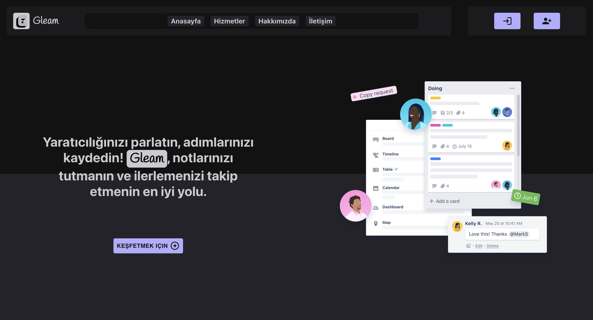

# Gleam: Not Alma ve Zaman Yönetimi Web Uygulaması

Gleam, notlarınızı tutmanıza ve tamamlama sürelerini yönetmenize olanak sağlayan bir web uygulamasıdır. Bu uygulama, kullanıcıların notlarını eklemelerine, düzenlemelerine ve zamanlayıcılarla birlikte tamamlama sürelerini belirlemelerine olanak tanır. Ayrıca, popüler Pomodoro Tekniği'ni uygulayarak verimliliği artırmak için entegre bir zaman yönetimi aracı sunar.

----

----

## Projede aşağıdaki teknolojiler kullanılmaktadır:

- React
- TypeScript
- SCSS
- Redux
- Firebase
- Material UI

## Özellikler

- **Not Alma:** Kullanıcılar, istedikleri herhangi bir notu ekleyebilir, düzenleyebilir ve silebilir.
  
- **Tamamlama Süresi:** Her not için bir tamamlama süresi belirlenebilir ve not tamamlandığında bildirim alınabilir.
  
- **Pomodoro Tekniği Entegrasyonu:** Kullanıcılar, Pomodoro Tekniği'ni kullanarak çalışma ve mola sürelerini yönetebilirler.
  
- **Kullanıcı Dostu Arayüz:** Sadelik ve kullanım kolaylığına odaklanan bir arayüz tasarımıyla, kullanıcılar hızlı ve verimli bir şekilde notlarını yönetebilirler.
  
- **Mobil Uyumlu:** Gleam, farklı cihazlarda ve ekran boyutlarında sorunsuz bir şekilde çalışacak şekilde tasarlanmıştır, böylece kullanıcılar istedikleri zaman ve herhangi bir cihaz üzerinden erişim sağlayabilirler.
